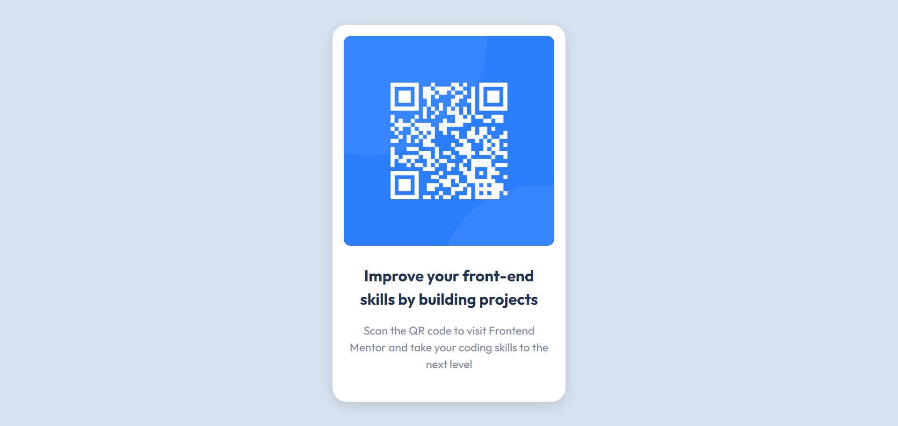

# Frontend Mentor - QR code component solution

This is a solution to the [QR code component challenge on Frontend Mentor](https://www.frontendmentor.io/challenges/qr-code-component-iux_sIO_H). Frontend Mentor challenges help you improve your coding skills by building realistic projects. 

## Overview

### Screenshot

### Links

- Solution URL: https://www.frontendmentor.io/solutions/qr-code-component-RCL2RofkvV
- Live Site URL: https://akash20x.github.io/QR-code-component/

## My process

### Built with

- Semantic HTML5 markup
- CSS custom properties
- Flexbox

### What I learned

* Positioning elements with flexbox and CSS

## Author

- Website - [Akash Jain](https://github.com/Akash20x)
- Frontend Mentor - [@akash](https://www.frontendmentor.io/profile/Akash20x)

